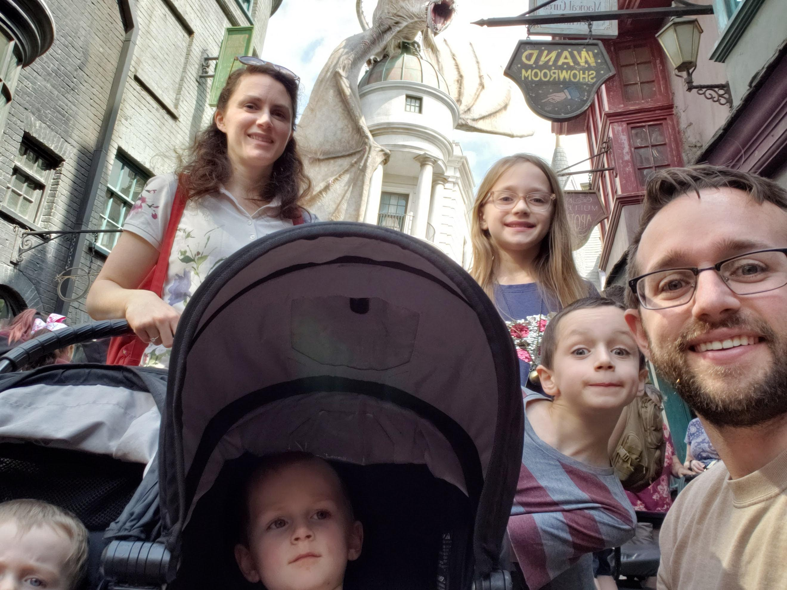

```{r setup, include=FALSE}
knitr::opts_chunk$set(echo = F)
knitr::opts_knit$set(root.dir = './')
source("resources/preamble.R")

f <- function (x) {formatC(x, format="d", big.mark=',')}
bold <- function(x) {paste('{\\textbf{',x,'}}', sep ='')}
gray <- function(x) {paste('{\\textcolor{gray}{',x,'}}', sep ='')}
wrapify <- function (x) {paste("{", x, "}", sep="")}
p <- function (x) {formatC(x, format='f', digits=1, big.mark=',')}
library(igraph)
```

<style type="text/css">

/* Changes to RevealJS default formatting.

I prefer this style but you can change these to your preferences */

/* This bit lets you do columns */
.container{
  display: flex;
}

.col{
  flex: 1;
}

.reveal section img{
border: none;
background: none;
box-shadow: none;
}

.highlight {
color: LightCoral;
}

.reveal h1,
.reveal h2,
.reveal h3,
.reveal h4,
.reveal h5,
.reveal h6 {
text-transform: none;
}

.reveal h1 {
margin-top:200px;
}

div.footnote {
font-size: 40%;
text-align: right;
}

.bg-image{
width: 180px;
}

.reveal .slides section .fragment.fade-in-then-out,
.reveal .slides section .fragment.current-visible {
  opacity: 0;
  visibility: hidden; }
  .reveal .slides section .fragment.fade-in-then-out.current-fragment,
  .reveal .slides section .fragment.current-visible.current-fragment {
    opacity: 1;
    visibility: inherit; }

.reveal .slides section .fragment.fade-in-then-semi-out {
  opacity: 0;
  visibility: hidden; }
  .reveal .slides section .fragment.fade-in-then-semi-out.visible {
    opacity: 0.5;
    visibility: inherit; }
  .reveal .slides section .fragment.fade-in-then-semi-out.current-fragment {
    opacity: 1;
visibility: inherit; }

</style>

## Today's Dad Joke
I accidentally swallowed a bunch of scrabble tiles.


My next trip to the bathroom could spell disaster.

## Housekeeping

> - Exam on Thursday!



## Last Class

> - Only 9 people were here!

<p>
<iframe class='fragment' src="https://giphy.com/embed/3o7TKNFxAjTwUEDurS" width="880" height="422" frameBorder="0" class="giphy-embed" allowFullScreen></iframe>
</p>


# Ego networks

## Sources of ego networks

> - Surveys of individuals
> - "Extraction" from complete network
> - Usually one step from ego


## What can we measure about ego networks?

> - Degree centrality (size)
> - Density
> - Groups
> - Distance
> - Homogeneity
> - Homophily
> - Composition

## How can we use ego network data?

> - GSS data
>	- Changes over time
>	- Comparison by location
> - Predicting individual outcomes
>	- Health
>	- Employment
>	- Happiness


# Review

## Network representations

> - Matrices
> - Edgelists
> - Directed/undirected
> - Ego
> - Bipartite / 2 mode
>	- Projections

## R

> - Vectors
> - Matrices
> - Data frames
> - Creating an igraph network object
> - Viewing/setting attributes on nodes/edges

## Network measures

>- Degree Centrality
>- Closeness Centrality
>- Betweenness Centrality
>- Eigenvector Centrality
>- Density
>- Centralization


## Homework

> - Study! :)
