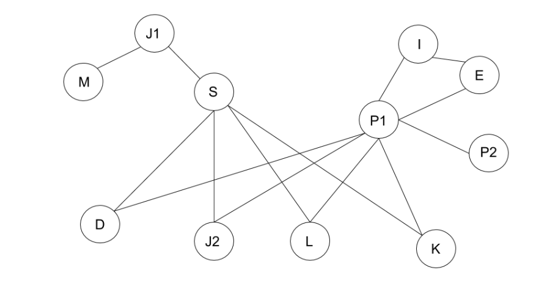

```{r setup, include=FALSE}
knitr::opts_chunk$set(echo = TRUE)
knitr::opts_knit$set(root.dir = './')
source("resources/preamble.R")

f <- function (x) {formatC(x, format="d", big.mark=',')}
bold <- function(x) {paste('{\\textbf{',x,'}}', sep ='')}
gray <- function(x) {paste('{\\textcolor{gray}{',x,'}}', sep ='')}
wrapify <- function (x) {paste("{", x, "}", sep="")}
p <- function (x) {formatC(x, format='f', digits=1, big.mark=',')}
library(igraph)
```

<style type="text/css">

/* Changes to RevealJS default formatting.

I prefer this style but you can change these to your preferences */

/* This bit lets you do columns */
.container{
  display: flex;
}

.col{
  flex: 1;
}

.reveal section img{
border: none;
background: none;
box-shadow: none;
}

.highlight {
color: LightCoral;
}

.reveal h1,
.reveal h2,
.reveal h3,
.reveal h4,
.reveal h5,
.reveal h6 {
text-transform: none;
}

.reveal h1 {
margin-top:200px;
}

div.footnote {
font-size: 40%;
text-align: right;
}

.bg-image{
width: 180px;
}

.reveal .slides section .fragment.fade-in-then-out,
.reveal .slides section .fragment.current-visible {
  opacity: 0;
  visibility: hidden; }
  .reveal .slides section .fragment.fade-in-then-out.current-fragment,
  .reveal .slides section .fragment.current-visible.current-fragment {
    opacity: 1;
    visibility: inherit; }

.reveal .slides section .fragment.fade-in-then-semi-out {
  opacity: 0;
  visibility: hidden; }
  .reveal .slides section .fragment.fade-in-then-semi-out.visible {
    opacity: 0.5;
    visibility: inherit; }
  .reveal .slides section .fragment.fade-in-then-semi-out.current-fragment {
    opacity: 1;
visibility: inherit; }

</style>

## Today's Dad Joke
- My girlfriend left me because I'm insecure.

> - Nevermind, she's back. She just went to the bathroom.

# Learning R

## Housekeeping

> - Feedback on Brightspace
> - Self-assessment reflections

## Homework

> - What are you still struggling with?
> - Example problems
>	- Creating matrices
>	- Selecting matrix elements


## Using Rstudio

> - R files
> - R notebooks

## Homework

> - Finish chapters 4 and 5


# Networks in R

## Today's Dad Joke

Everyone has the 4th of July off except fire.


Fireworks on the 4th of July.

## Housekeeping

> - Guest lecture next Thursday
> - Exam on February 20

## Family Networks Hall of Fame


## Family Networks Hall of Fame



## Homework Questions

> - Factors vs. Booleans vs. Strings
> - Choosing elements in a data frame
>	- with indexing
>	- with the '$' notation
>	- with subset
>	- combining subset and indexing

<aside class='notes'>
Think, pair, choose random to share
</aside>

## Today

> - Networks in R
> - Network Analysis in R - chapter 1
> - Visualization exercise
>	- Use R to visualize your family network
>	- I'll feature my favorites
