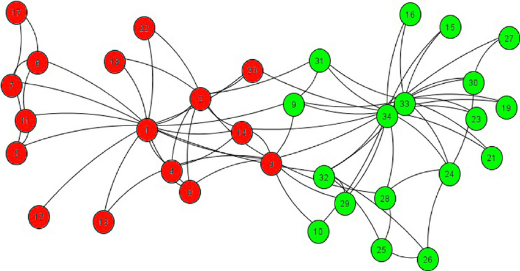

```{r setup, include=FALSE}
knitr::opts_chunk$set(echo = FALSE)
knitr::opts_knit$set(root.dir = './')
#source("resources/preamble.R")
library(tidygraph)
library(ggraph)
```
# Welcome to COM 411: Communication and Social Networks!

## About me

<div class='container'>
<div class='col fragment'>

</div>
<div class='col fragment'>

</div>
<div class='col fragment'>

</div>
</div>

## Dad Joke

Why did the nearsighted man fall in the well?

<span class='fragment'>He couldn't see that well!</span>

## Introductions
- Name
- Year
- Major
- Closest connection to a famous person 

## What is Communication and Social Networks?

<div class='container'>
<div class='col'>

</div>
<div class='col'>

</div>
</div>

<div style= "color:darkred; transform: rotate(17deg);" class='fragment'>NOT THIS KIND OF SOCIAL NETWORK!</div>

## Social networks are much more interesting!



>- How do groups make decisions?
>- How do fads and fashions and misinformation and diseases spread?
>- How do our connections influence our perceptions about and behavior in the world?

## Who you are connected to can be more important than who you are


## Who you are connected to can be more important than who you are


## Who you are connected to can be more important than who you are


## Goals
> 1. Understand the foundations of network theory and analysis
> 2. Critically read social network studies
> 3. Learn how social networks relate to your own interests
> 4. Gain a basic understanding of gathering and analyzing network data in R

# How we reach those goals

## About the class

> - Building a learning community
> - Discussions vs. lectures
> - Resolving confusion
> - Project-based

## Grading
>- Normal grading has some negative unintended consequences
<div class='container'>
<div class='col'>

</div>
</div>
>- How can we build a learning community?

## Grading
>- I'm interested in teaching, not assessing
> - Goal is to build structures that encourage learning and accountability
>- Assignments will be turned in on Brightspace and/or discussed in class
>- I will provide general feedback
>- 3 times during the semester you will turn in reflection pieces
>- If I disagree I will reach out

## Class Meetings

> - Most content is asynchronous
>	- Readings
>	- Video lectures
> - Tuesdays
>	- Time discussing + reviewing concepts and homework
>	- Random cold calling
> - Thursdays 
>	- Activities
>	- R Labs
>	- Co-working / Office Hours

## Class meetings

> - I will work hard to make our classes valuable
> - Do the same; be prepared, open, and engaged
> - Class discussions are a fundamental part of the class and I expect you to be at every class

## Assignments

>- Homework
>	- Social network concepts
>	- Programming practice
>- Reading
>   - 3-2-1 on Brightspace
>     - 3 things you learned / connections made
>     - 2 questions / things that are still confusing
      - 1 discussion question for class
>	- Discussion Questions due Monday at noon
>- Participation (in class and online)

## Readings
> - Academic papers
>	- Typically linked from wiki
>	- A few on Brightspace (I will make this clear)
> - Textbooks
>	- Networks, Crowds and Markets
>	- Introduction to social network methods

## Programming

>- You will understand what this means! :)

<div class='fragment'>
```{r, echo = T, message = F, warning=F, fig.height = 3.5}
create_notable('zachary') %>%
  activate(nodes) %>%
  mutate(group = as.factor(group_infomap())) %>%
  ggraph(layout = 'kk') +
  geom_edge_fan(width=.2) + 
  geom_node_point(aes(color = group), size = 5)
```
</div>

## Exam
> - One exam
>	- Goal is to encourage self-accountability

## Final Project

Options:

> - Group project: network-based intervention (e.g., spreading an idea on campus)
> - (Group?) research project: analysis of network data
> - "Pitch" to an organization about how what you have learned could be used to help their organization


# Resources

## Discord

> - Conversation and questions
> - Help
>	- In general, ask publicly so others can answer / see the answer

## Wiki

> - Schedule
> - Links to readings
> - Links to assignments

## Brightspace

> - Some readings
> - Submit assignments

## Office Hours

> - Tuesdays, 2-4
>	- Also open to meeting virtually

## Please be vocal
>- I will solicit feedback as part of reflections
>- Let me know what is and isn't working

## Assignments

> - Read the syllabus
> - Fill out the reflection on Brightspace
> - This Thursday will be a (fun!) synchronous activity
> - Bring your computer, if possible!
> - Make sure you are signed up on Discord


## Questions?

